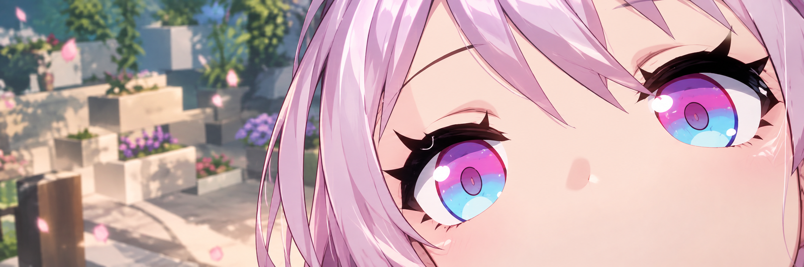

  
  
  
  
  
  

Hi 👋, I am **0xdolus**, an enthusiastic and ambitious full stack developer. I specialise in Web Development, JavaScript and Design. I love to network, join new communities and add value ✨

👀 More about me

- 🔭 Currently working on: YOUR_PROJECT
- 🌱 Learning: YOUR_TECH
- 💬 Ask me about: JavaScript, Web Development, Design
- 📫 Reach me on Discord: **0xdolus**

## 🔥 Github Stats

<table width="100%">
<tr>
<td width="58%" valign="top">

</td>
<td width="42%" align="center" valign="top">

</td>
</tr>
</table>

## 📘 My top open source projects

  

  
  
  
  

